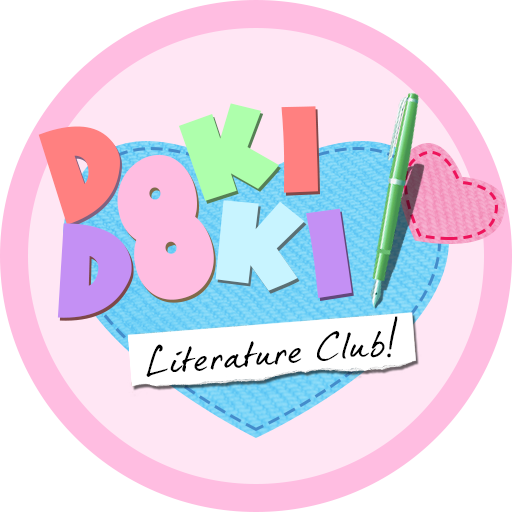

> [!IMPORTANT] 
> With the release of the official port of DDLC to mobile platforms, this project is mostly deprecated.
> I highly suggest supporting Team Salvato by [downloading the game from Play Store or App Store instead](https://teamsalvato.com/news/ddlc-is-now-available-on-ios-and-android/).

 
 <h1>Doki Doki Literature Club using Ren'Py 8!</h1>

  
  <!-- we must love the bun -->
  <!-- yes -->
 
 
   

This repository contains only files decompiled from `scripts.rpa` that were modified to make it work, and the assets for this README.

Decompiled sources are provided only for personal use. Creating standalone projects using DDLC sources is prohibited by Team Salvato [*(See "Fan Games" section in Team Salvato IP Guidelines)*](http://teamsalvato.com/ip-guidelines/)

## DDLC Mod Distribution Information

According to [Team Salvato IP Guidelines](http://teamsalvato.com/ip-guidelines/), modifications should be distributed as files with the extension .rpa and contain files that are necessary for installing the modification *(In most cases, this is just a scripts.rpa file or other files (if you replaced the graphics/fonts/audio in the game)*. Any modifications must **NOT** be distributed as a complete or standalone game and should only be installed on the existing official DDLC game installed on the user's computer

In my case, the actual game binary and a lot of libraries had to be included too, otherwise it would crash. Any art or sound file is not included.

## License

This software is licensed under [MIT License](https://github.com/SecondThundeR/DokiDoki-RenPy/blob/your-reality/LICENSE) and it is provided "AS IS" without any warranties.

All rights reserved by Team Salvato, who created DDLC.

Also thanks to [*SecondThundeR's decompilation*](https://github.com/SecondThundeR/DokiDoki-RenPy/) for using tools like `unrpa` and `unrpyc` so I don't have to lmao :trollface:
